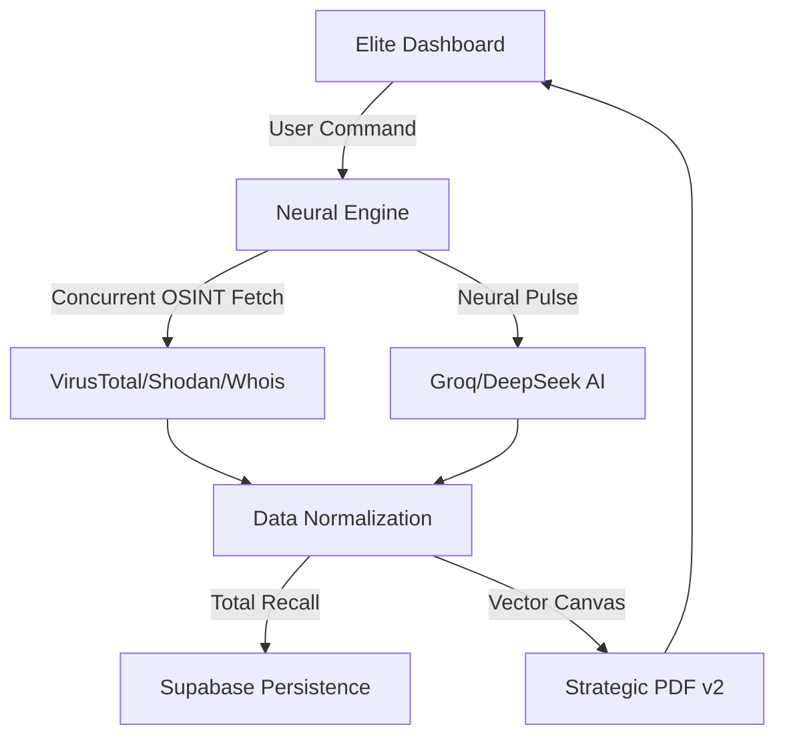

# 🟢 HEX AI - Elite Security Intelligence Platform (SOC v2.0)

[](https://reactjs.org)
[](https://www.typescriptlang.org)
[](https://hex-intelligence.com)

> 🛰️ **A high-fidelity, AI-driven Security Operations Center (SOC) designed for tactical threat intelligence, real-time vulnerability mapping, and executive strategic reporting.**

HEX AI is a professional-grade **Autonomous Intelligence Platform** built on a "Cyberdeck" aesthetic. It correlates disparate security data sources into a high-contrast, emerald-themed dashboard, providing immediate, actionable visibility into any digital infrastructure.

---

## ✨ Elite Features

### 🏗️ **The "Stratosphere" Dashboard**
- **High-Fidelity Layout**: Featuring 240px vertical investigation cards designed to hold massive amounts of WHOIS, registrar, and port data without clipping.
- **Glassmorphism Neural-Pulse**: UI elements that react with emerald-glow animations and inner-shadow depth for a premium hardware feel.
- **Midnight Aesthetic**: Optimized for long-range tactical monitoring with a deep `#020617` black background and high-intensity `#10b981` emerald accents.

### 📄 **Strategic Reporting v2.0**
- **Vector Infographics**: Every report includes a vector-drawn **Risk Metric Bar** that visually represents threat intensity.
- **Intelligent Sectioning**: AI findings are automatically parsed and formatted with bold emerald headers (e.g., `>> FINDINGS:`) for instant readability.
- **Babel Sanitization**: Advanced filtering that strips encoding artifacts, ensuring a 100% clean, executive-ready PDF output.

### 💾 **"Total Recall" Persistence**
- **Atomic Archiving**: Every investigation—from OSINT data to AI analysis—is atomically archived to Supabase after completion.
- **Ghost-Scan Guard**: Built-in state sentinels prevent accidental re-scanning during history loading, saving API tokens and ensuring data integrity.

### 📡 **Intelligence Stack**
- **VirusTotal (v3)**: Real-time reputation scoring and threat actor correlation.
- **Shodan Hub**: Live port discovery and CVE mapping via secure serverless proxies.
- **SafeMap™ Engine**: Interactive Leaflet implementation with neural "Cyber Grid" textures and high-accuracy geolocation.

---

## 🏗️ Technical Architecture

HEX AI uses a zero-trust, high-performance architecture optimized for secure intelligence handling:



---

## 💻 Tech Stack

- **Framework**: React 18 + TypeScript + Vite
- **Infrastructure**: Netlify Serverless (CORS Bypass Proxies)
- **Database**: Supabase (PostgreSQL + Auth + History)
- **AI Core**: Groq Inference Engine / DeepSeek R1
- **Reporting**: jsPDF (Vector Graphics Engine)
- **Aesthetics**: Vanilla CSS + Tailwind + Neural-Glow Filters

---

## 🚀 Deployment & Setup

### **Environment Variables**
```env
VITE_VIRUSTOTAL_API_KEY=YOUR_KEY
VITE_SHODAN_API_KEY=YOUR_KEY
VITE_SUPABASE_URL=YOUR_URL
VITE_SUPABASE_ANON_KEY=YOUR_KEY
VITE_GROQ_API_KEY=YOUR_KEY
```

### **Local Deployment**
```bash
npm install
npm run dev
```

---

## ⚖️ Legal Disclaimer

This platform is intended for **Educational Purposes and Authorized Security Testing** only. The developers are not responsible for unauthorized or illegal use of this tool.

---

**🕵️‍♂️ Tactical Intel • 🛰️ Autonomous Recon • 🛡️ Strategic Defense**

Final Major Project Submission • Created for **The Future of AI Security**.


**Made with ❤️ by the Hex AI Team (Gautam Kumar | Gaurav Pehljaani | Joy Edwin Minz)**
